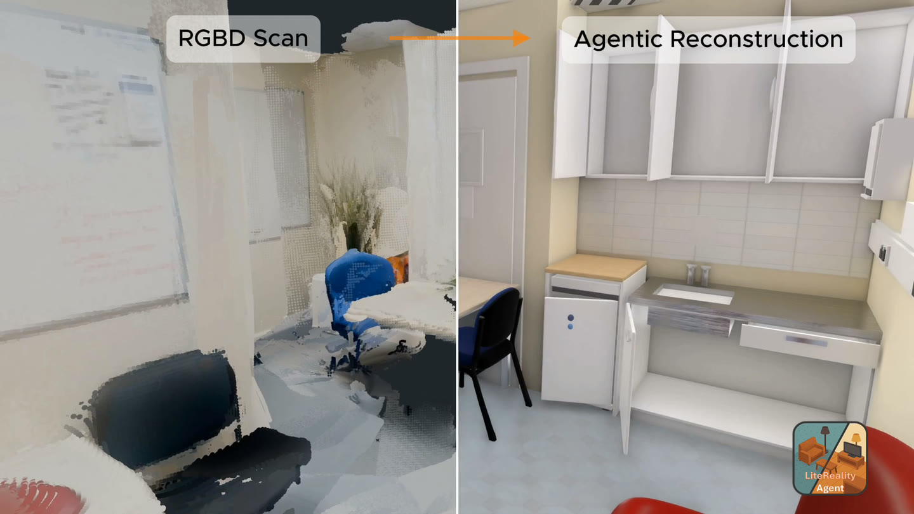

<p align="center">
<h1 align="center">LiteReality-Agent</h1>
<h3 align="center">An Agentic System for Interactable 3D Indoor Scene Reconstruction</h3>
</p>
<p align="center">
  <h3 align="center"><a href="https://litereality.github.io/Litereality-agent-site/">Website</a> | <a href="https://litereality.github.io/Litereality-agent-site/litereality-agent-post/">Blog</a> | <a href="https://apps.apple.com/gb/app/litereality/id6774158260">LiteReality Scanner</a></h3>
</p>

<p align="center">
  
</p>

An open-source, end-to-end toolkit for reconstructing interactable indoor 3D scenes. Scan a room
with the [LiteReality Scanner](https://apps.apple.com/gb/app/litereality/id6774158260); the agent turns it into
a complete, graphics-ready scene with articulated assets.

## How to use

1. **Get the scanner app** — [LiteReality Scanner on the App Store](https://apps.apple.com/gb/app/litereality/id6774158260), free.
2. **Scan your room.** One walkthrough captures the RGB frames, depth, and the RoomPlan
   `room.usdz` the pipeline needs.
3. **Upload the scan** to the machine you'll run on.
4. **Run LiteReality-Agent** — `uv run litereality run <path/to/scan>` — for an articulated,
   realistic room reconstruction.

**Test scenes.** Don't have a scan yet? Clone the example room scans and start from them:

```bash
git clone https://github.com/LiteReality/example-scans.git
uv run litereality run example-scans/<scan>
```

## Requirements

Tested on **macOS** (Apple Silicon) and **Linux** (with a >=24 GB GPU).

1. [`uv`](https://docs.astral.sh/uv/) — `curl -LsSf https://astral.sh/uv/install.sh | sh`
2. **Blender 5.x** (tested on 5.1). `BLENDER_PATH` points at the install *directory*, not the binary.
3. **OpenAI API key** for reference image generation — typically under $1 per scene.
4. **A logged-in agent CLI on your `PATH`** — this drives all reasoning. `claude`
   (Claude Code) is the default; `codex` (OpenAI Codex) is also supported, selected with
   `LR_AGENT_PROVIDER`.
5. **Somewhere to run TRELLIS and GroundingDINO** — either a [Modal](https://modal.com) account
   (recommended; free tier, no local GPU, works on macOS) or a Linux box with a ≥24 GB NVIDIA GPU.
   See [Install](#install) — this is the one real choice in the setup.

## Install

TRELLIS and GroundingDINO need a GPU. By default they run **hosted on Modal**, so nothing heavy
runs on your machine and an Apple Silicon Mac with no GPU is enough — Modal's free tier covers this
workload comfortably. Got your own Linux GPU? See [deploy/local-gpu.md](deploy/local-gpu.md)
instead.

**1. Install the environment.**

```bash
uv sync --frozen --extra modal --group dev
cp .env.example .env
```

**2. Fill in `.env`.**

| variable | where it comes from |
|---|---|
| `OPENAI_API_KEY` | reference image generation — typically under $1 per scene |
| `MODAL_TOKEN_ID` · `MODAL_TOKEN_SECRET` | a free [Modal](https://modal.com) account → [modal.com/settings/tokens](https://modal.com/settings/tokens) |
| `BLENDER_PATH` | your Blender install **directory**, not the binary |
| `LR_SCANS_DIR` | the folder holding your scans |

for example:
```dotenv
OPENAI_API_KEY=sk-...
MODAL_TOKEN_ID=ak-...
MODAL_TOKEN_SECRET=as-...
BLENDER_PATH=/Applications/Blender.app/Contents/MacOS
LR_SCANS_DIR=~/scans
```

**3. Deploy the models.**

```bash
uv run litereality setup
```

One-time per workspace. See [deploy/modal/README.md](deploy/modal/README.md) for details.

**4. Check you're ready to go.**

```bash
SANITY_DEEP=1 uv run python sanity.py
```


## Run

The installed CLI is the only supported pipeline entry point. One command runs everything:

```bash
uv run litereality run /path/to/capture
```

### The stages

A reconstruction has two stages  **scene init** followed by **authoring**.

Scene init is deterministic
Authoring is agentic: the agent looks at the seed room, compares it against the capture,
and edits it until it matches. Either half can be run on its own.

```bash
# scene init — capture to seed room
uv run litereality run /path/to/capture --through seed

# authoring — seed room to finished room, on a package init already produced
uv run litereality stage author run/my-room --force --polish
```

`--polish` adds object refinement, materials, and a model-driven quality pass on top of authoring.

## Development

Safe local verification is limited to static checks, offline unit tests, CLI parsing, and package
builds:

```bash
uv run ruff check src tests sanity.py scripts
uv run pytest -q
uv build
```

Tests marked `blender`, `scan`, or `live` are excluded by default.

## Citation

A technical report is coming. In the meantime:

```bibtex
@article{huang2026litereality-agent,
  title   = {{LiteReality-Agent}: An Agentic System for
             Interactable 3D Indoor Scene Reconstruction},
  author  = {Huang, Zhening and Li, Yueyan and Chiu, Johnathan and
             Lyu, Xiaoyang and Zhou, Matt and Yao, Yuxin and
             Lasenby, Joan and Wu, Shangzhe},
  year    = {2026}
}
```
