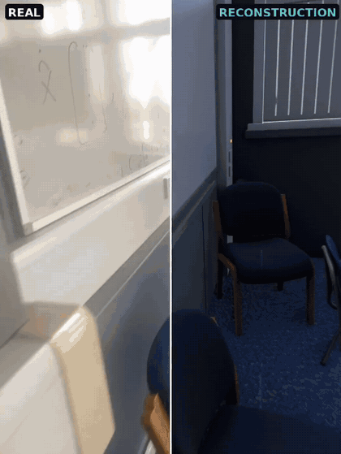

# LiteReality-Agent

LiteReality-Agent is a full-stack package that turns an indoor room scan into a realistic,
simulation-ready reconstruction — the scanner, the agentic authoring loop, and the integration
layer on top.

<p align="center">
  
</p>

## How to use

1. **Get the scanner app** — join the TestFlight beta at
   [testflight.apple.com/join/EbNYmVGV](https://testflight.apple.com/join/EbNYmVGV).
2. **Scan your room.** One walkthrough captures the RGB frames, depth, and the RoomPlan
   `room.usdz` the pipeline needs.
3. **Upload the scan** to the machine you'll run on.
4. **Run LiteReality-Agent** — `./run.sh <path/to/scan>` — for an articulated, realistic room reconstruction.

The result is an editable room program (Room.py) that can be compiled in Blender and integrated into other engines.

**Test scenes.** Don't have a scan yet? Clone the example room scans from
[LiteReality/example-scans](https://github.com/LiteReality/example-scans) and run any of them by
pointing at the folder:

```bash
git clone https://github.com/LiteReality/example-scans.git
./run.sh example-scans/<scan>
```


## Requirements

This repository has been tested on **macOS** (Apple Silicon) and **Linux** (with a 24 GB GPU).

1. [`uv`](https://docs.astral.sh/uv/) — `curl -LsSf https://astral.sh/uv/install.sh | sh`
2. Blender 5.x
4. **OpenAI/google API key** for reference image generation (typically costs less than $1 per scene)
5. **logged-in agent CLI** on your `PATH` — drives all reasoning and vision. 
`claude` (Claude Code) is the default; `codex` (OpenAI Codex) is also supported
6. **RunPod API key** (typically costs less than $1 per scene): https://www.runpod.io/ 

(required on macOS for Trellis; can also be installed locally if you are on Linux, see more below)


## Install

**1. Install the env** (torch/DINO included — required):

```bash
uv sync --frozen --extra detect --group dev
```

**2. Configure** — Copy `.env.example` to `.env` and fill in the required values:

- `OPENAI_API_KEY` / `GOOGLE_API_KEY` — API key for reference image generation.
- `BLENDER_PATH` — Your **Blender installation directory** (the folder containing the `blender` binary).
- `RUNPOD_TRELLIS_ENDPOINT` + `RUNPOD_API_KEY` — your own RunPod Serverless TRELLIS endpoint ID
  and API key.
- `GROUNDING_DINO_PYTHON`

If you do not want to use RunPod and are on Linux, install TRELLIS locally and provide the TRELLIS Python environment path:

- `TRELLIS_PYTHON` — Path to the local GPU TRELLIS environment's Python interpreter.

**3. Check you're ready to go.** `sanity.py` verifies your dependencies, models, Blender installation, and API keys, and prints the exact fix for anything missing.

```bash
uv run python sanity.py
```

## Run

Both stages, end to end — give it a scan folder, or a name to resolve under `$LR_SCANS_DIR`:

```bash
./run.sh example-scans/Office_room     # the capture folder, from anywhere
```

Each stage prints as it completes, and per-stage logs land in `run/<scan>/`.
Or one stage at a time — the point of the seam:

```bash
uv run -m litereality_agent scene_init example-scans/Office_room          # stage 1 → a scene package
uv run -m litereality_agent realism_authoring run/Office_room   # stage 2, realism_authoring
```

You get, in `run/<scan>/`:

| file | what |
|---|---|
| `Room.py` | the room as an editable program — walls, openings, objects, materials, fixtures |
| `Room.glb` | the built room, ready to drop into another engine |
| `<scan>.html` | a self-contained Three.js viewer — open it directly, no server needed |
| `scene.json` | the manifest: every path, root and capture location this scene needs |

The Three.js viewer is deliberately lightweight: it is there to check geometry and layout at a
glance, and does **not** reproduce the full PBR shading. For the accurate look, open the Blender
file — `Room.blend`, written next to the preview GLB at
`run/<scan>/scene_stage/_oneshot/room_preview/`.

### Seeing what the agent did

The viewer's **trace** panel shows the run's event log — stage boundaries, image-generation calls,
reconstruction and QC events, with elapsed times. That is built in by default, no extra step.

```bash
./report.sh <scan>          # richer per-stage report — see the caveat below
```

